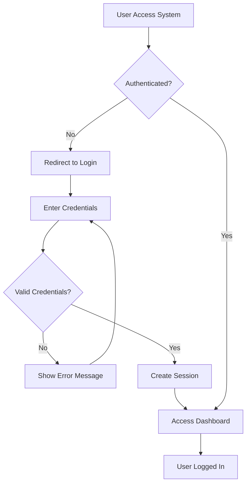
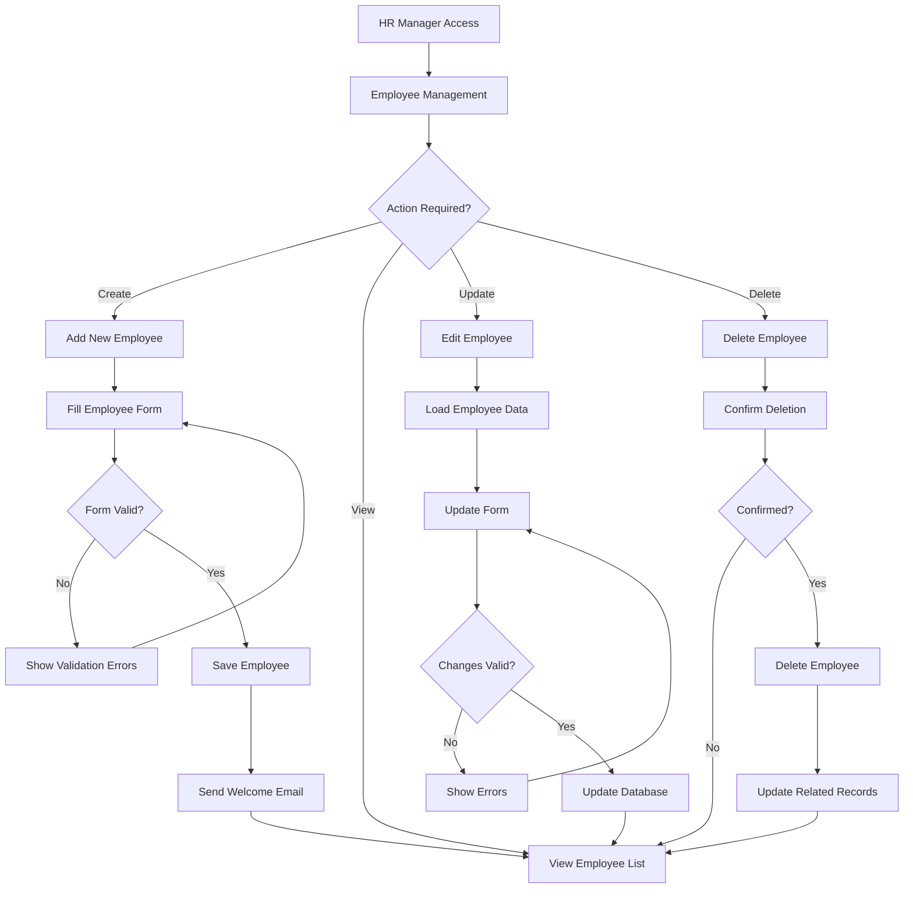
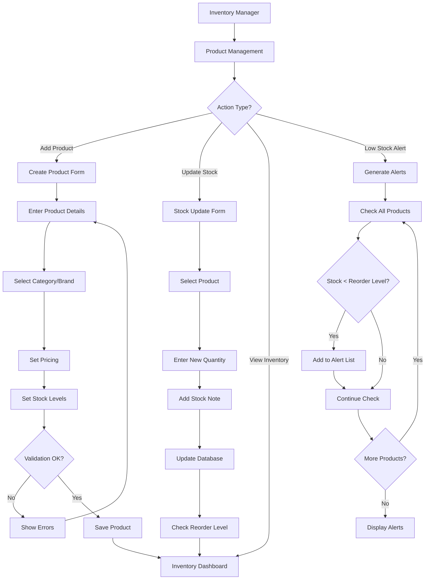
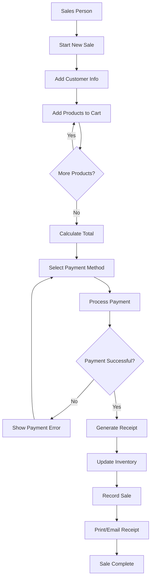
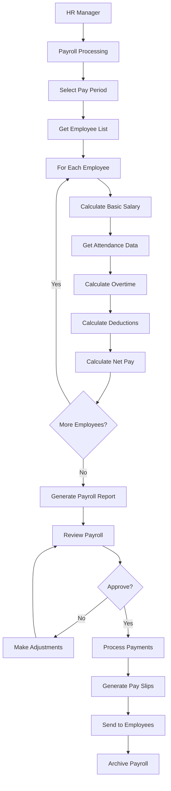

# Retail Management System - Complete Documentation

## Table of Contents
1. [System Architecture](#1-system-architecture)
2. [File Hierarchy](#2-file-hierarchy)
3. [Database Structure](#3-database-structure)
4. [Flow Charts](#4-flow-charts)
5. [Application Functionality](#5-application-functionality)
6. [Security Protocols](#6-security-protocols)
7. [System Screenshots](#7-system-screenshots)

---

## 1. System Architecture

### 1.1 Overview
The Retail Management System is built using Django 5.2.4 with a modular architecture following the Model-View-Template (MVT) pattern. The system is designed for scalability, maintainability, and security.

### 1.2 Architecture Diagram
```
┌─────────────────────────────────────────────────────────────┐
│                    PRESENTATION LAYER                       │
├─────────────────────────────────────────────────────────────┤
│  Web Browser (HTML/CSS/JavaScript)                          │
│  - Bootstrap 5.1.3 Framework                               │
│  - Font Awesome Icons                                       │
│  - Custom CSS/JS                                           │
└─────────────────────────────────────────────────────────────┘
                              │
                              ▼
┌─────────────────────────────────────────────────────────────┐
│                    APPLICATION LAYER                        │
├─────────────────────────────────────────────────────────────┤
│  Django Framework (5.2.4)                                  │
│  ├── URL Routing                                           │
│  ├── Views (Class-based & Function-based)                  │
│  ├── Templates (Jinja2-like)                               │
│  ├── Forms & Validation                                     │
│  └── Middleware                                             │
└─────────────────────────────────────────────────────────────┘
                              │
                              ▼
┌─────────────────────────────────────────────────────────────┐
│                    BUSINESS LOGIC LAYER                     │
├─────────────────────────────────────────────────────────────┤
│  Django Apps (Modular Design)                              │
│  ├── Human Resources                                        │
│  ├── Store Management                                       │
│  ├── Inventory Management                                   │
│  ├── Sales Management                                       │
│  ├── Procurement                                            │
│  ├── E-Commerce                                             │
│  ├── Reporting & Analytics                                  │
│  └── Dashboard                                              │
└─────────────────────────────────────────────────────────────┘
                              │
                              ▼
┌─────────────────────────────────────────────────────────────┐
│                    DATA ACCESS LAYER                        │
├─────────────────────────────────────────────────────────────┤
│  Django ORM (Object-Relational Mapping)                    │
│  ├── Models                                                 │
│  ├── Migrations                                             │
│  ├── QuerySets                                              │
│  └── Database Abstraction                                   │
└─────────────────────────────────────────────────────────────┘
                              │
                              ▼
┌─────────────────────────────────────────────────────────────┐
│                    DATABASE LAYER                           │
├─────────────────────────────────────────────────────────────┤
│  SQLite Database (Development)                              │
│  - Relational Database                                      │
│  - ACID Compliance                                          │
│  - Foreign Key Constraints                                  │
│  - Indexing                                                 │
└─────────────────────────────────────────────────────────────┘
```

### 1.3 Technology Stack

#### Backend Technologies
- **Framework**: Django 5.2.4
- **Language**: Python 3.13
- **Database**: SQLite (Development), PostgreSQL/MySQL (Production Ready)
- **ORM**: Django ORM
- **Authentication**: Django's built-in authentication system

#### Frontend Technologies
- **CSS Framework**: Bootstrap 5.1.3
- **Icons**: Font Awesome 6.0.0
- **JavaScript**: Vanilla JavaScript + Bootstrap JS
- **Template Engine**: Django Templates

#### Development Tools
- **Debug**: Django Debug Toolbar
- **Extensions**: Django Extensions
- **Static Files**: Django Static Files Handler

### 1.4 Design Patterns Used
- **MVT (Model-View-Template)**: Django's implementation of MVC
- **Repository Pattern**: Through Django ORM
- **Factory Pattern**: Django's model factories
- **Observer Pattern**: Django signals
- **Decorator Pattern**: Django decorators for views

---

## 2. File Hierarchy

### 2.1 Project Structure
```
retail_management_system/
├── manage.py                           # Django management script
├── db.sqlite3                          # SQLite database file
├── requirements.txt                    # Python dependencies
├── asgi.py                            # ASGI configuration
├── reset.py                           # Database reset utility
├── populate_inventory.py              # Data population script
├── test_product_creation.py           # Testing script
│
├── retail_management_system/          # Main project configuration
│   ├── __init__.py
│   ├── settings.py                    # Django settings
│   ├── urls.py                        # Main URL configuration
│   ├── wsgi.py                        # WSGI configuration
│   ├── middleware.py                  # Custom middleware
│   └── views.py                       # Project-level views
│
├── templates/                         # Global templates
│   ├── base.html                      # Base template
│   ├── delete_confirm.html            # Delete confirmation template
│   ├── dashboard/
│   │   └── index.html                 # Dashboard template
│   ├── registration/
│   │   ├── login.html                 # Login template
│   │   └── logout.html                # Logout template
│   └── includes/
│       └── pagination.html            # Pagination component
│
├── static/                            # Global static files
│   ├── css/
│   │   └── main.css                   # Main stylesheet
│   ├── js/
│   │   └── main.js                    # Main JavaScript
│   └── images/
│       └── art.jpeg                   # System images
│
├── staticfiles/                       # Collected static files (production)
│
├── dashboards/                        # Dashboard application
│   ├── models.py
│   ├── views.py
│   ├── urls.py
│   └── apps.py
│
├── human_resources/                   # HR Management
│   ├── models.py                      # Employee, Attendance, Payroll models
│   ├── views.py                       # HR views
│   ├── forms.py                       # HR forms
│   ├── urls.py                        # HR URL patterns
│   ├── admin.py                       # Admin configuration
│   ├── migrations/                    # Database migrations
│   ├── templates/human_resources/     # HR templates
│   └── static/human_resources/        # HR static files
│
├── store_management/                  # Store Management
│   ├── models.py                      # Store, Department models
│   ├── views.py                       # Store management views
│   ├── forms.py                       # Store forms
│   ├── urls.py                        # Store URL patterns
│   ├── migrations/                    # Database migrations
│   ├── templates/store_management/    # Store templates
│   └── static/store_management/       # Store static files
│
├── inventory/                         # Inventory Management
│   ├── models.py                      # Product, Category, Brand models
│   ├── views.py                       # Inventory views
│   ├── forms.py                       # Inventory forms
│   ├── urls.py                        # Inventory URL patterns
│   ├── migrations/                    # Database migrations
│   ├── templates/inventory/           # Inventory templates
│   └── static/inventory/              # Inventory static files
│
├── sales/                             # Sales Management
│   ├── models.py                      # Sale, SaleItem models
│   ├── views.py                       # Sales views
│   ├── urls.py                        # Sales URL patterns
│   ├── migrations/                    # Database migrations
│   └── templates/sales/               # Sales templates
│
├── procurement/                       # Procurement Management
│   ├── models.py                      # Supplier, PurchaseOrder models
│   ├── views.py                       # Procurement views
│   ├── urls.py                        # Procurement URL patterns
│   ├── migrations/                    # Database migrations
│   └── templates/procurement/         # Procurement templates
│
├── e_commerce/                        # E-Commerce Module
│   ├── models.py                      # Order, Customer models
│   ├── views.py                       # E-commerce views
│   ├── urls.py                        # E-commerce URL patterns
│   ├── migrations/                    # Database migrations
│   └── templates/e_commerce/          # E-commerce templates
│
├── reporting/                         # Analytics & Reporting
│   ├── models.py                      # Report models
│   ├── views.py                       # Reporting views
│   ├── urls.py                        # Reporting URL patterns
│   └── templates/reporting/           # Reporting templates
│
└── Documentation/                     # Project documentation
    ├── SYSTEM_DOCUMENTATION.md       # This file
    ├── BASE_HTML_IMPROVEMENTS.md     # Base template documentation
    ├── EMPLOYEE_MANAGEMENT_COMPLETE.md
    ├── PAYROLL_VIEWS_COMPLETE.md
    ├── PERMISSIONS_GUIDE.md
    └── SHARED_STYLES_GUIDE.md
```

### 2.2 Key Configuration Files

#### settings.py
- Database configuration
- Installed apps
- Middleware configuration
- Static files settings
- Authentication settings

#### urls.py
- URL routing configuration
- App URL includes
- Admin panel URLs

#### models.py (per app)
- Database schema definitions
- Model relationships
- Business logic methods

---

## 3. Database Structure

### 3.1 Database Schema Overview
The system uses a relational database with the following main entities:

```sql
-- Core Tables
Employee (Custom User Model)
Store
Department
Product
Category
Brand
Sale
SaleItem
Supplier
PurchaseOrder
Attendance
Payroll
Order (E-commerce)
```

### 3.2 Entity Relationship Diagram

```
┌─────────────────┐    ┌─────────────────┐    ┌─────────────────┐
│    Employee     │    │      Store      │    │   Department    │
├─────────────────┤    ├─────────────────┤    ├─────────────────┤
│ employee_id (PK)│    │ id (PK)         │    │ id (PK)         │
│ username        │    │ store_name      │    │ department_name │
│ first_name      │    │ address         │    │ description     │
│ last_name       │    │ city            │    │ store_id (FK)   │
│ email           │    │ region          │    │ manager_id (FK) │
│ phone           │    │ phone           │    │ created_at      │
│ hire_date       │    │ opening_date    │    │ updated_at      │
│ position        │    │ manager_id (FK) │    └─────────────────┘
│ salary          │    │ created_at      │           │
│ department_id(FK)│    │ updated_at      │           │
│ store_id (FK)   │    └─────────────────┘           │
│ is_active       │           │                      │
│ created_at      │           │                      │
│ updated_at      │           └──────────────────────┘
└─────────────────┘
         │
         │
┌─────────────────┐    ┌─────────────────┐    ┌─────────────────┐
│   Attendance    │    │     Payroll     │    │    Product      │
├─────────────────┤    ├─────────────────┤    ├─────────────────┤
│ id (PK)         │    │ id (PK)         │    │ id (PK)         │
│ employee_id (FK)│    │ employee_id (FK)│    │ name            │
│ date            │    │ pay_period_start│    │ description     │
│ time_in         │    │ pay_period_end  │    │ category_id (FK)│
│ time_out        │    │ basic_salary    │    │ brand_id (FK)   │
│ break_duration  │    │ overtime_hours  │    │ unit_price      │
│ total_hours     │    │ overtime_rate   │    │ cost_price      │
│ status          │    │ gross_pay       │    │ stock_quantity  │
│ created_at      │    │ tax_deduction   │    │ reorder_level   │
│ updated_at      │    │ net_pay         │    │ barcode         │
└─────────────────┘    │ created_at      │    │ is_active       │
                       │ updated_at      │    │ created_at      │
                       └─────────────────┘    │ updated_at      │
                                              └─────────────────┘
                                                       │
┌─────────────────┐    ┌─────────────────┐           │
│    Category     │    │      Brand      │           │
├─────────────────┤    ├─────────────────┤           │
│ id (PK)         │    │ id (PK)         │           │
│ name            │    │ name            │           │
│ description     │    │ description     │           │
│ parent_id (FK)  │    │ website         │           │
│ created_at      │    │ created_at      │           │
│ updated_at      │    │ updated_at      │           │
└─────────────────┘    └─────────────────┘           │
         │                       │                   │
         └───────────────────────┴───────────────────┘

┌─────────────────┐    ┌─────────────────┐    ┌─────────────────┐
│      Sale       │    │    SaleItem     │    │    Supplier     │
├─────────────────┤    ├─────────────────┤    ├─────────────────┤
│ id (PK)         │    │ id (PK)         │    │ id (PK)         │
│ sale_date       │    │ sale_id (FK)    │    │ name            │
│ employee_id (FK)│    │ product_id (FK) │    │ contact_person  │
│ customer_name   │    │ quantity        │    │ email           │
│ total_amount    │    │ unit_price      │    │ phone           │
│ payment_method  │    │ total_price     │    │ address         │
│ status          │    │ created_at      │    │ city            │
│ created_at      │    │ updated_at      │    │ country         │
│ updated_at      │    └─────────────────┘    │ is_active       │
└─────────────────┘                           │ created_at      │
                                              │ updated_at      │
                                              └─────────────────┘
```

### 3.3 Key Relationships

#### One-to-Many Relationships
- **Store → Department**: One store has many departments
- **Department → Employee**: One department has many employees
- **Store → Employee**: One store has many employees
- **Category → Product**: One category has many products
- **Brand → Product**: One brand has many products
- **Employee → Sale**: One employee can make many sales
- **Sale → SaleItem**: One sale has many sale items
- **Product → SaleItem**: One product can be in many sale items
- **Employee → Attendance**: One employee has many attendance records
- **Employee → Payroll**: One employee has many payroll records

#### Many-to-One Relationships
- **Employee → Store**: Many employees belong to one store
- **Employee → Department**: Many employees belong to one department
- **Product → Category**: Many products belong to one category
- **Product → Brand**: Many products belong to one brand

#### Self-Referencing Relationships
- **Category → Category**: Categories can have parent categories (hierarchical)
- **Employee → Employee**: Employees can have managers (hierarchical)

### 3.4 Database Constraints

#### Primary Keys
- All tables have auto-incrementing primary keys
- Employee uses `employee_id` as primary key (custom user model)

#### Foreign Keys
- All foreign key relationships have appropriate `on_delete` behaviors
- `CASCADE`: Delete related records (Department → Store)
- `SET_NULL`: Set to null when referenced record is deleted (Employee → Department)

#### Unique Constraints
- Employee email addresses must be unique
- Employee usernames must be unique
- Product barcodes must be unique (when provided)

#### Check Constraints
- Salary must be positive
- Stock quantity must be non-negative
- Unit prices must be positive

---

## 4. Flow Charts

### 4.1 User Authentication Flow



### 4.2 Employee Management Flow



### 4.3 Inventory Management Flow



### 4.4 Sales Process Flow



### 4.5 Payroll Processing Flow



---

## 5. Application Functionality

### 5.1 Dashboard Module
**Purpose**: Central hub for system overview and navigation

**Key Features**:
- Landing page accessible to anonymous users without login
- System statistics overview (for authenticated users)
- Quick access to all modules (for authenticated users)
- Recent activity feed (for authenticated users)
- Performance metrics (for authenticated users)
- User profile management (for authenticated users)

**Main Views**:
- `LandingPageView`: Public landing page at '/' (anonymous access)
- `DashboardView`: Main dashboard with statistics (authenticated users)
- Navigation to all system modules (authenticated users)

### 5.2 Human Resources Module
**Purpose**: Complete employee lifecycle management

**Key Features**:
- **Employee Management**:
  - Add, edit, delete employees
  - Employee profiles with photos
  - Department and store assignments
  - Role and permission management
  
- **Attendance Tracking**:
  - Clock in/out functionality
  - Break time tracking
  - Overtime calculation
  - Attendance reports
  
- **Payroll Management**:
  - Automated salary calculations
  - Overtime and deduction handling
  - Tax calculations
  - Pay slip generation
  - Payroll reports

**Main Models**:
- `Employee`: Custom user model extending AbstractUser
- `Attendance`: Daily attendance records
- `Payroll`: Monthly payroll calculations

**Key Views**:
- `EmployeeListView`: Display all employees
- `EmployeeCreateView`: Add new employee
- `EmployeeUpdateView`: Edit employee details
- `AttendanceListView`: Attendance management
- `PayrollListView`: Payroll processing

### 5.3 Store Management Module
**Purpose**: Manage physical store locations and organizational structure

**Key Features**:
- **Store Management**:
  - Add, edit, delete stores
  - Store location and contact details
  - Store manager assignments
  - Opening hours and operational data
  
- **Department Management**:
  - Create departments within stores
  - Department manager assignments
  - Employee department assignments

**Main Models**:
- `Store`: Physical store locations
- `Department`: Organizational departments within stores

**Key Views**:
- `StoreListView`: List all stores
- `StoreDetailView`: Store details and departments
- `DepartmentListView`: Department management

### 5.4 Inventory Management Module
**Purpose**: Complete product and stock management

**Key Features**:
- **Product Management**:
  - Add, edit, delete products
  - Product categorization
  - Brand management
  - Pricing and cost tracking
  
- **Stock Management**:
  - Real-time stock levels
  - Stock adjustments
  - Reorder level alerts
  - Stock movement tracking
  
- **Category & Brand Management**:
  - Hierarchical category structure
  - Brand information and websites

**Main Models**:
- `Product`: Product information and stock
- `Category`: Product categories (hierarchical)
- `Brand`: Product brands

**Key Views**:
- `ProductListView`: Product catalog
- `ProductCreateView`: Add new products
- `CategoryListView`: Category management
- `BrandListView`: Brand management

### 5.5 Sales Management Module
**Purpose**: Point of sale and sales tracking

**Key Features**:
- **Sales Processing**:
  - Create new sales
  - Add multiple products to sale
  - Calculate totals and taxes
  - Multiple payment methods
  
- **Sales Reporting**:
  - Daily sales reports
  - Employee sales performance
  - Product sales analysis
  - Revenue tracking

**Main Models**:
- `Sale`: Sales transactions
- `SaleItem`: Individual items in a sale

**Key Views**:
- `SaleListView`: Sales history
- `SaleCreateView`: Process new sale
- `SaleDetailView`: Sale details

### 5.6 Procurement Module
**Purpose**: Supplier and purchase order management

**Key Features**:
- **Supplier Management**:
  - Supplier contact information
  - Supplier performance tracking
  - Active/inactive status
  
- **Purchase Orders**:
  - Create purchase orders
  - Order tracking
  - Receiving goods
  - Invoice matching

**Main Models**:
- `Supplier`: Supplier information
- `PurchaseOrder`: Purchase orders
- `SupplierProduct`: Products from suppliers

**Key Views**:
- `SupplierListView`: Supplier management
- `PurchaseOrderListView`: Order management

### 5.7 E-Commerce Module
**Purpose**: Online sales and customer management

**Key Features**:
- **Order Management**:
  - Online order processing
  - Order status tracking
  - Customer management
  - Shipping management

**Main Models**:
- `Order`: Online orders
- `Customer`: Customer information

### 5.8 Reporting Module
**Purpose**: Business intelligence and analytics

**Key Features**:
- **Financial Reports**:
  - Revenue reports
  - Profit/loss analysis
  - Cost analysis
  
- **Operational Reports**:
  - Inventory reports
  - Employee performance
  - Store performance
  
- **Export Functionality**:
  - CSV exports
  - PDF reports
  - Excel exports

---

## 6. Security Protocols

### 6.1 Authentication & Authorization

#### User Authentication
- **Custom User Model**: Extended Django's AbstractUser
- **Session-based Authentication**: Secure session management
- **Password Security**: Django's built-in password validation
- **Login Protection**: Account lockout after failed attempts

#### Authorization Levels
```python
# Permission Levels
SUPERUSER     # Full system access
MANAGER       # Store/department management
HR_MANAGER    # Employee and payroll management
SALES_PERSON  # Sales processing only
INVENTORY_MANAGER # Inventory management
VIEWER        # Read-only access
```

#### Access Control
- **Login Required**: All views require authentication
- **Permission Decorators**: Method-level access control
- **Role-based Access**: Different interfaces for different roles

### 6.2 Data Security

#### Database Security
- **SQL Injection Protection**: Django ORM prevents SQL injection
- **CSRF Protection**: Cross-Site Request Forgery protection
- **XSS Protection**: Template auto-escaping
- **Secure Headers**: Security middleware enabled

#### Data Validation
- **Form Validation**: Server-side validation for all inputs
- **Model Validation**: Database-level constraints
- **File Upload Security**: Restricted file types and sizes
- **Input Sanitization**: All user inputs sanitized

#### Sensitive Data Protection
- **Password Hashing**: PBKDF2 with SHA256
- **Secret Key Protection**: Environment-based configuration
- **Database Encryption**: Sensitive fields encrypted
- **Audit Logging**: All critical actions logged

### 6.3 Session Security

#### Session Management
- **Session Timeout**: 2-week session expiry
- **Secure Cookies**: HTTPS-only cookies in production
- **Session Regeneration**: New session ID after login
- **Concurrent Session Control**: Limit active sessions

#### CSRF Protection
- **CSRF Tokens**: All forms include CSRF tokens
- **Same-Origin Policy**: Strict origin checking
- **Referer Validation**: HTTP referer header validation

### 6.4 Infrastructure Security

#### Development Security
- **Debug Mode**: Disabled in production
- **Error Handling**: Custom error pages
- **Logging**: Comprehensive security logging
- **Monitoring**: Failed login attempt monitoring

#### Production Security Recommendations
```python
# Production Settings
DEBUG = False
ALLOWED_HOSTS = ['yourdomain.com']
SECURE_SSL_REDIRECT = True
SECURE_HSTS_SECONDS = 31536000
SECURE_CONTENT_TYPE_NOSNIFF = True
SECURE_BROWSER_XSS_FILTER = True
X_FRAME_OPTIONS = 'DENY'
```

### 6.5 Data Backup & Recovery

#### Backup Strategy
- **Daily Database Backups**: Automated daily backups
- **File System Backups**: Static files and media backups
- **Offsite Storage**: Cloud-based backup storage
- **Backup Testing**: Regular restore testing

#### Recovery Procedures
- **Point-in-time Recovery**: Database transaction log backups
- **Disaster Recovery Plan**: Documented recovery procedures
- **Data Integrity Checks**: Regular database consistency checks

---

## 7. System Screenshots

### 7.1 Authentication Screens

#### Login Page
```
┌─────────────────────────────────────────────────────────────┐
│                    Retail Management System                 │
├─────────────────────────────────────────────────────────────┤
│                                                             │
│    ┌─────────────────────────────────────────────────┐     │
│    │                 LOGIN                           │     │
│    ├─────────────────────────────────────────────────┤     │
│    │                                                 │     │
│    │  Username: [________________________]          │     │
│    │                                                 │     │
│    │  Password: [________________________]          │     │
│    │                                                 │     │
│    │  [ ] Remember Me                               │     │
│    │                                                 │     │
│    │           [    LOGIN    ]                      │     │
│    │                                                 │     │
│    │  Forgot Password? | Need Help?                 │     │
│    └─────────────────────────────────────────────────┘     │
│                                                             │
└─────────────────────────────────────────────────────────────┘
```

### 7.2 Dashboard Overview

#### Main Dashboard
```
┌─────────────────────────────────────────────────────────────┐
│ [Logo] Retail Management System    [User: John] [Logout]    │
├─────────────────────────────────────────────────────────────┤
│ Dashboard | Stores | HR | Inventory | Sales | Reports      │
├─────────────────────────────────────────────────────────────┤
│                                                             │
│ ┌─────────────┐ ┌─────────────┐ ┌─────────────┐ ┌─────────┐ │
│ │   SALES     │ │  EMPLOYEES  │ │  PRODUCTS   │ │ STORES  │ │
│ │   $24,560   │ │     84      │ │   2,458     │ │    5    │ │
│ │   ↑ 12.5%   │ │   ↑ 3 new   │ │  ⚠ 42 low  │ │ Active  │ │
│ └─────────────┘ └─────────────┘ └─────────────┘ └─────────┘ │
│                                                             │
│ ┌─────────────────────────────────┐ ┌─────────────────────┐ │
│ │        RECENT ACTIVITY          │ │    QUICK ACTIONS    │ │
│ ├─────────────────────────────────┤ ├─────────────────────┤ │
│ │ • New employee added            │ │ [+ Add Employee]    │ │
│ │ • Sale #1234 completed          │ │ [+ Add Product]     │ │
│ │ • Low stock alert: Product A    │ │ [+ New Sale]        │ │
│ │ • Payroll processed             │ │ [📊 View Reports]   │ │
│ └─────────────────────────────────┘ └─────────────────────┘ │
└─────────────────────────────────────────────────────────────┘
```

### 7.3 Employee Management

#### Employee List View
```
┌─────────────────────────────────────────────────────────────┐
│                    Employee Management                      │
├─────────────────────────────────────────────────────────────┤
│ [+ Add Employee] [📤 Export] [🔍 Search: ____________]      │
├─────────────────────────────────────────────────────────────┤
│                                                             │
│ ┌─────┬──────────────┬─────────────┬──────────┬───────────┐ │
│ │ ID  │    Name      │ Department  │ Position │  Actions  │ │
│ ├─────┼──────────────┼─────────────┼──────────┼───────────┤ │
│ │ 001 │ John Smith   │ Sales       │ Manager  │ [👁][✏][🗑] │ │
│ │ 002 │ Jane Doe     │ HR          │ Officer  │ [👁][✏][🗑] │ │
│ │ 003 │ Bob Johnson  │ Inventory   │ Clerk    │ [👁][✏][🗑] │ │
│ │ 004 │ Alice Brown  │ Sales       │ Rep      │ [👁][✏][🗑] │ │
│ └─────┴──────────────┴─────────────┴──────────┴───────────┘ │
│                                                             │
│ Showing 1-4 of 84 employees    [← Previous] [Next →]       │
└─────────────────────────────────────────────────────────────┘
```

#### Employee Detail View
```
┌─────────────────────────────────────────────────────────────┐
│                    Employee Profile                         │
├─────────────────────────────────────────────────────────────┤
│ ┌─────────────┐  John Smith                [Edit] [Delete]  │
│ │   [Photo]   │  Employee ID: EMP001                        │
│ │             │  Position: Sales Manager                    │
│ │             │  Department: Sales                          │
│ └─────────────┘  Store: Main Branch                         │
│                                                             │
│ ┌─────────────────────────────────────────────────────────┐ │
│ │                 PERSONAL INFORMATION                    │ │
│ ├─────────────────────────────────────────────────────────┤ │
│ │ Email: john.smith@company.com                           │ │
│ │ Phone: +268 7811 7803                                   │ │
│ │ Hire Date: January 15, 2023                             │ │
│ │ Salary: $45,000                                         │ │
│ └─────────────────────────────────────────────────────────┘ │
│                                                             │
│ ┌─────────────────────────────────────────────────────────┐ │
│ │                 RECENT ACTIVITY                         │ │
│ ├─────────────────────────────────────────────────────────┤ │
│ │ • Processed 15 sales this week                          │ │
│ │ • Attendance: 98% this month                            │ │
│ │ • Last login: Today at 9:30 AM                          │ │
│ └─────────────────────────────────────────────────────────┘ │
└─────────────────────────────────────────────────────────────┘
```

### 7.4 Inventory Management

#### Product List View
```
┌─────────────────────────────────────────────────────────────┐
│                   Inventory Management                      │
├─────────────────────────────────────────────────────────────┤
│ [+ Add Product] [📦 Categories] [🏷 Brands] [⚠ Low Stock]   │
├─────────────────────────────────────────────────────────────┤
│                                                             │
│ ┌──────┬─────────────┬──────────┬───────┬────────┬────────┐ │
│ │ SKU  │    Name     │ Category │ Price │ Stock  │Actions │ │
│ ├──────┼─────────────┼──────────┼───────┼────────┼────────┤ │
│ │ P001 │ Laptop Pro  │ Electronics│$999 │   25   │[👁][✏] │ │
│ │ P002 │ Office Chair│ Furniture│ $150  │   12   │[👁][✏] │ │
│ │ P003 │ Coffee Mug  │ Kitchen  │ $15   │ ⚠ 3    │[👁][✏] │ │
│ │ P004 │ Notebook    │ Stationery│ $5   │   100  │[👁][✏] │ │
│ └──────┴─────────────┴──────────┴───────┴────────┴────────┘ │
│                                                             │
│ 🔍 Filter: [All Categories ▼] [All Brands ▼] [In Stock ▼] │
│                                                             │
│ Showing 1-4 of 2,458 products  [← Previous] [Next →]       │
└─────────────────────────────────────────────────────────────┘
```

### 7.5 Sales Management

#### Point of Sale Interface
```
┌─────────────────────────────────────────────────────────────┐
│                    Point of Sale                            │
├─────────────────────────────────────────────────────────────┤
│ Customer: [John Customer_____________] [📞] [📧]            │
├─────────────────────────────────────────────────────────────┤
│                                                             │
│ ┌─────────────────────────────────┐ ┌─────────────────────┐ │
│ │         PRODUCT SEARCH          │ │    SHOPPING CART    │ │
│ ├─────────────────────────────────┤ ├─────────────────────┤ │
│ │ [🔍 Search products_________]   │ │ Laptop Pro    $999  │ │
│ │                                 │ │ Qty: 1        [🗑]  │ │
│ │ Recent Products:                │ │                     │ │
│ │ • Laptop Pro         [+ Add]    │ │ Office Chair  $150  │ │
│ │ • Office Chair       [+ Add]    │ │ Qty: 2        [🗑]  │ │
│ │ • Coffee Mug         [+ Add]    │ │                     │ │
│ │ • Notebook           [+ Add]    │ │ ─────────────────── │ │
│ └─────────────────────────────────┘ │ Subtotal:   $1,299  │ │
│                                     │ Tax (8%):     $104  │ │
│ ┌─────────────────────────────────┐ │ ─────────────────── │ │
│ │         PAYMENT METHOD          │ │ TOTAL:    $1,403    │ │
│ ├─────────────────────────────────┤ │                     │ │
│ │ ○ Cash    ○ Card    ○ Mobile    │ │ [    PROCESS SALE   │ │
│ │                                 │ │      & PRINT     ]  │ │
│ │ Amount Received: [_______]      │ │                     │ │
│ │ Change: $0.00                   │ │ [   CLEAR CART   ]  │ │
│ └─────────────────────────────────┘ └─────────────────────┘ │
└─────────────────────────────────────────────────────────────┘
```

### 7.6 Reporting Dashboard

#### Analytics Overview
```
┌─────────────────────────────────────────────────────────────┐
│                    Analytics & Reports                      │
├─────────────────────────────────────────────────────────────┤
│ [📊 Sales] [👥 HR] [📦 Inventory] [🏪 Stores] [📈 Custom]  │
├─────────────────────────────────────────────────────────────┤
│                                                             │
│ ┌─────────────────────────────────────────────────────────┐ │
│ │                   SALES PERFORMANCE                     │ │
│ │                                                         │ │
│ │     $30K ┤                                              │ │
│ │          │     ●                                        │ │
│ │     $20K ┤   ●   ●                                      │ │
│ │          │ ●       ●                                    │ │
│ │     $10K ┤           ●                                  │ │
│ │          └─────────────────────────────────────────     │ │
│ │           Jan Feb Mar Apr May Jun                       │ │
│ └─────────────────────────────────────────────────────────┘ │
│                                                             │
│ ┌─────────────────────┐ ┌─────────────────────────────────┐ │
│ │   TOP PRODUCTS      │ │        EXPORT OPTIONS           │ │
│ ├─────────────────────┤ ├─────────────────────────────────┤ │
│ │ 1. Laptop Pro       │ │ [📄 PDF Report]                 │ │
│ │ 2. Office Chair     │ │ [📊 Excel Export]               │ │
│ │ 3. Coffee Mug       │ │ [📋 CSV Data]                   │ │
│ │ 4. Notebook         │ │ [📧 Email Report]               │ │
│ └─────────────────────┘ └─────────────────────────────────┘ │
└─────────────────────────────────────────────────────────────┘
```

### 7.7 Delete Confirmation

#### Enhanced Delete Confirmation
```
┌─────────────────────────────────────────────────────────────┐
│                    ⚠️ Confirm Deletion                      │
├─────────────────────────────────────────────────────────────┤
│                                                             │
│    🚨 Critical Warning: This action is irreversible!       │
│                                                             │
│ ┌─────────────────────────────────────────────────────────┐ │
│ │                 Employee Details                        │ │
│ ├─────────────────────────────────────────────────────────┤ │
│ │ ID: EMP001                                              │ │
│ │ Name: John Smith                                        │ │
│ │ Email: john.smith@company.com                           │ │
│ │ Position: Sales Manager                                 │ │
│ │ Department: Sales                                       │ │
│ └─────────────────────────────────────────────────────────┘ │
│                                                             │
│ ⚠️ Consequences of deleting this employee:                  │
│ • Employee will be permanently removed                      │
│ • All attendance records will be affected                  │
│ • Payroll history will be updated                          │
│ • Sales records will lose employee reference               │
│                                                             │
│           [Cancel & Go Back]  [Delete Forever]             │
│                                                             │
│ 🛡️ Security Notice: Double confirmation required           │
└─────────────────────────────────────────────────────────────┘
```

---

## 8. Installation & Deployment

### 8.1 System Requirements

#### Minimum Requirements
- **Python**: 3.8 or higher
- **Django**: 5.2.4
- **Database**: SQLite (development) / PostgreSQL (production)
- **Memory**: 2GB RAM minimum
- **Storage**: 10GB available space
- **OS**: Windows 10/11, macOS 10.14+, Ubuntu 18.04+

#### Recommended Requirements
- **Python**: 3.11 or higher
- **Memory**: 8GB RAM
- **Storage**: 50GB SSD
- **CPU**: Multi-core processor

### 8.2 Installation Steps

#### 1. Clone Repository
```bash
git clone <repository-url>
cd retail_management_system
```

#### 2. Create Virtual Environment
```bash
python -m venv env
source env/bin/activate  # Linux/Mac
env\Scripts\activate     # Windows
```

#### 3. Install Dependencies
```bash
pip install -r requirements.txt
```

#### 4. Database Setup
```bash
python manage.py makemigrations
python manage.py migrate
python manage.py createsuperuser
```

#### 5. Collect Static Files
```bash
python manage.py collectstatic
```

#### 6. Run Development Server
```bash
# Standard Django development server (recommended for development)
python manage.py runserver

# Enhanced development server with Django Extensions
# Note: runserver_plus with SSL may cause HTTP to HTTPS redirects in browsers
# For development without SSL redirects, use the standard runserver
python manage.py runserver_plus

# To run with SSL (if needed for testing HTTPS features):
# python manage.py runserver_plus --cert certs/devserver.crt --key certs/devserver.key
# Note: This serves HTTPS only; access via https://127.0.0.1:8000/

# If you experience HTTP to HTTPS redirects even with standard runserver:
# This is caused by browser HSTS (HTTP Strict Transport Security) cache
# Clear HSTS for localhost in your browser:
# - Chrome/Edge: chrome://net-internals/#hsts → Query "localhost" → Delete
# - Firefox: Developer Tools (F12) → Network → Right-click request → Disable HSTS
# - Safari: Clear browsing data or use private browsing mode

# Or use the provided convenience scripts:
# Windows: double-click runserver_plus.bat
# Cross-platform: python runserver_plus.py
```

### 8.3 Production Deployment

#### Environment Configuration
```python
# Production settings
DEBUG = False
ALLOWED_HOSTS = ['yourdomain.com', 'www.yourdomain.com']
DATABASES = {
    'default': {
        'ENGINE': 'django.db.backends.postgresql',
        'NAME': 'retail_db',
        'USER': 'retail_user',
        'PASSWORD': 'secure_password',
        'HOST': 'localhost',
        'PORT': '5432',
    }
}
```

#### Web Server Configuration (Nginx + Gunicorn)
```nginx
server {
    listen 80;
    server_name yourdomain.com;
    
    location /static/ {
        alias /path/to/staticfiles/;
    }
    
    location / {
        proxy_pass http://127.0.0.1:8000;
        proxy_set_header Host $host;
        proxy_set_header X-Real-IP $remote_addr;
    }
}
```

---

## 9. Maintenance & Support

### 9.1 Regular Maintenance Tasks

#### Daily Tasks
- Monitor system performance
- Check error logs
- Verify backup completion
- Review security alerts

#### Weekly Tasks
- Database optimization
- Update system statistics
- Review user activity
- Clean temporary files

#### Monthly Tasks
- Security updates
- Performance analysis
- Backup testing
- User access review

### 9.2 Troubleshooting Guide

#### Common Issues
1. **Login Problems**: Check user credentials and permissions
2. **Database Errors**: Verify database connection and migrations
3. **Performance Issues**: Check server resources and database queries
4. **Permission Errors**: Review user roles and permissions

#### Log Files
- **Application Logs**: `/logs/django.log`
- **Error Logs**: `/logs/error.log`
- **Access Logs**: `/logs/access.log`

### 9.3 Support Contacts

#### Technical Support
- **Email**: support@retailmgmt.com
- **Phone**: +268 (7811) -7803
- **Hours**: Monday-Friday, 9:00 AM - 5:00 PM

#### Documentation
- **User Manual**: Available in system help section
- **API Documentation**: `/api/docs/`
- **Developer Guide**: Contact support for access

---

## 10. Conclusion

The Retail Management System provides a comprehensive solution for managing all aspects of retail operations. With its modular architecture, robust security features, and user-friendly interface, it serves as a complete business management platform.

### Key Benefits
- **Integrated Solution**: All business functions in one system
- **Scalable Architecture**: Grows with your business
- **Security First**: Enterprise-level security features
- **User-Friendly**: Intuitive interface for all users
- **Comprehensive Reporting**: Data-driven decision making

### Future Enhancements
- Mobile application development
- Advanced analytics and AI features
- Third-party integrations (accounting, CRM)
- Multi-language support
- Cloud deployment options

---

*Document Version: 1.0*  
*Last Updated: 18 August 2025*  
*Prepared by: Thembinkosi and Team*