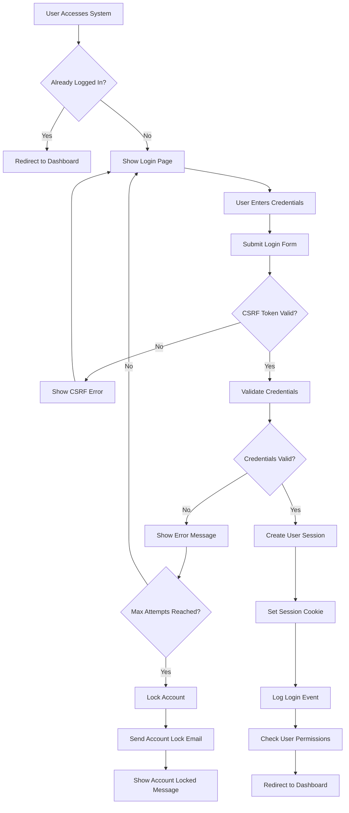
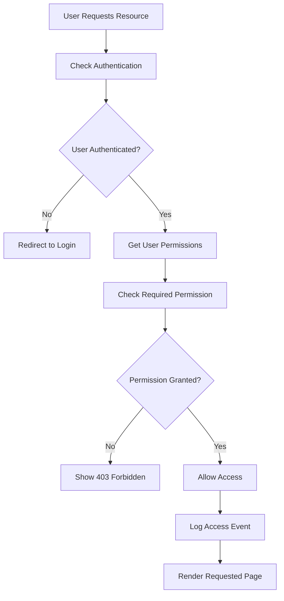
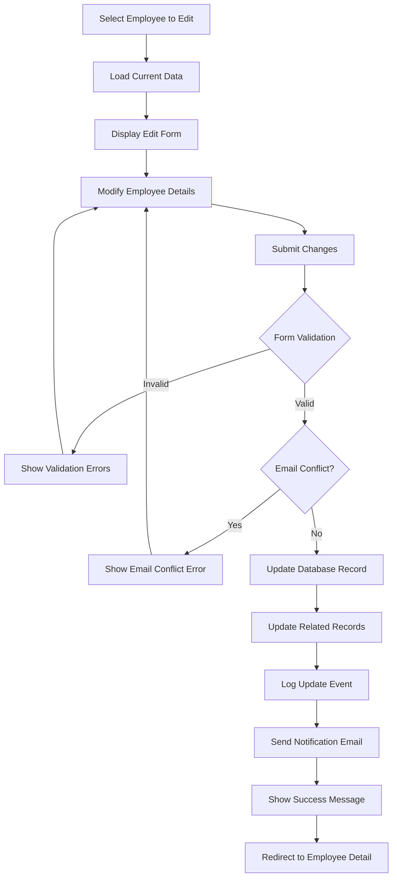
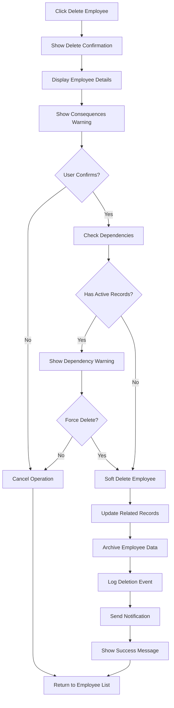
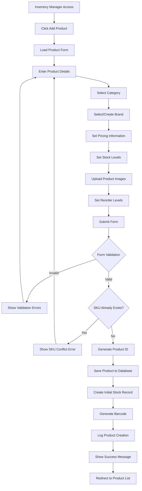
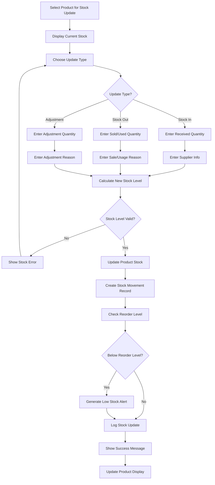
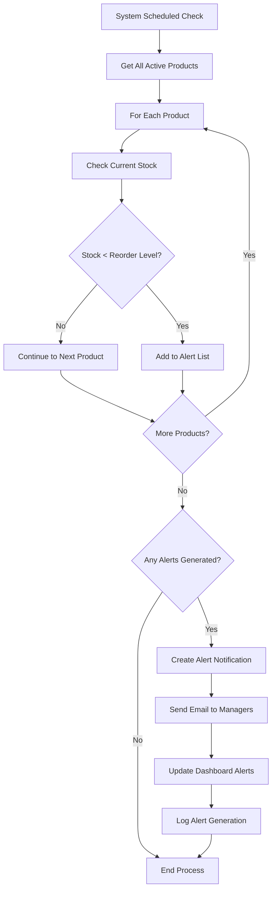
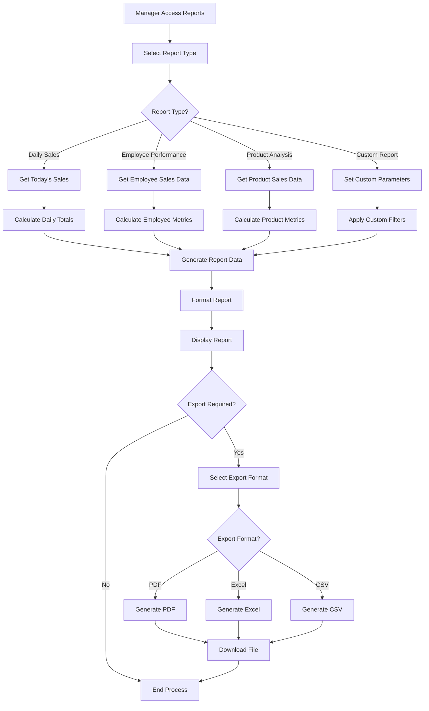
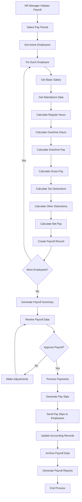
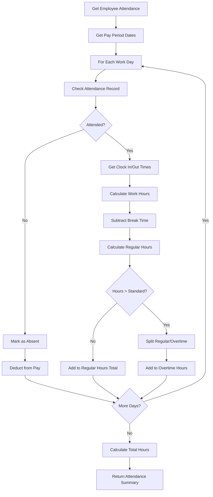

# Retail Management System - Flow Charts & Process Diagrams

## Table of Contents
1. [System Architecture Flow](#1-system-architecture-flow)
2. [User Authentication Flow](#2-user-authentication-flow)
3. [Employee Management Flow](#3-employee-management-flow)
4. [Inventory Management Flow](#4-inventory-management-flow)
5. [Sales Process Flow](#5-sales-process-flow)
6. [Payroll Processing Flow](#6-payroll-processing-flow)
7. [Data Flow Diagrams](#7-data-flow-diagrams)

---

## 1. System Architecture Flow

### High-Level System Architecture
```
┌─────────────────────────────────────────────────────────────┐
│                    USER INTERFACE LAYER                     │
├─────────────────────────────────────────────────────────────┤
│  Web Browser │ Mobile App │ API Clients │ Admin Interface  │
└─────────────────────────────────────────────────────────────┘
                              │
                              ▼
┌─────────────────────────────────────────────────────────────┐
│                   WEB SERVER LAYER                          │
├─────────────────────────────────────────────────────────────┤
│  Nginx/Apache │ Load Balancer │ SSL Termination │ Caching  │
└─────────────────────────────────────────────────────────────┘
                              │
                              ▼
┌─────────────────────────────────────────────────────────────┐
│                 APPLICATION SERVER LAYER                    │
├─────────────────────────────────────────────────────────────┤
│  Django Application │ Gunicorn │ WSGI │ Session Management │
└─────────────────────────────────────────────────────────────┘
                              │
                              ▼
┌─────────────────────────────────────────────────────────────┐
│                   BUSINESS LOGIC LAYER                      │
├─────────────────────────────────────────────────────────────┤
│ HR Module │ Store Mgmt │ Inventory │ Sales │ Procurement    │
└─────────────────────────────────────────────────────────────┘
                              │
                              ▼
┌─────────────────────────────────────────────────────────────┐
│                    DATA ACCESS LAYER                        │
├─────────────────────────────────────────────────────────────┤
│  Django ORM │ Database Connections │ Query Optimization     │
└─────────────────────────────────────────────────────────────┘
                              │
                              ▼
┌─────────────────────────────────────────────────────────────┐
│                     DATABASE LAYER                          │
├─────────────────────────────────────────────────────────────┤
│  PostgreSQL │ SQLite │ Redis Cache │ File Storage          │
└─────────────────────────────────────────────────────────────┘
```

---

## 2. User Authentication Flow

### Login Process Flow


### Permission Check Flow


---

## 3. Employee Management Flow

### Employee Creation Process
```mermaid
graph TD
    A[HR Manager Clicks Add Employee] --> B[Load Employee Form]
    B --> C[Fill Employee Details]
    C --> D[Select Department/Store]
    D --> E[Set Permissions/Role]
    E --> F[Upload Photo (Optional)]
    F --> G[Submit Form]
    
    G --> H{Form Validation}
    H -->|Invalid| I[Show Validation Errors]
    I --> C
    
    H -->|Valid| J{Email Already Exists?}
    J -->|Yes| K[Show Email Error]
    K --> C
    
    J -->|No| L{Username Available?}
    L -->|No| M[Show Username Error]
    M --> C
    
    L -->|Yes| N[Create Employee Record]
    N --> O[Generate Employee ID]
    O --> P[Hash Password]
    P --> Q[Save to Database]
    Q --> R[Create User Account]
    R --> S[Send Welcome Email]
    S --> T[Log Creation Event]
    T --> U[Redirect to Employee List]
```

### Employee Update Process


### Employee Deletion Process


---

## 4. Inventory Management Flow

### Product Addition Flow


### Stock Update Flow


### Low Stock Alert Flow


---

## 5. Sales Process Flow

### Point of Sale Flow
```mermaid
graph TD
    A[Sales Person Login] --> B[Open POS Interface]
    B --> C[Start New Sale]
    C --> D[Enter Customer Info (Optional)]
    D --> E[Scan/Search Product]
    E --> F{Product Found?}
    F -->|No| G[Show Product Not Found]
    G --> E
    
    F -->|Yes| H[Check Stock Availability]
    H --> I{Stock Available?}
    I -->|No| J[Show Out of Stock]
    J --> E
    
    I -->|Yes| K[Add Product to Cart]
    K --> L[Enter Quantity]
    L --> M[Calculate Line Total]
    M --> N[Update Cart Display]
    N --> O{Add More Products?}
    O -->|Yes| E
    
    O -->|No| P[Calculate Sale Total]
    P --> Q[Apply Discounts (If Any)]
    Q --> R[Calculate Tax]
    R --> S[Display Final Total]
    S --> T[Select Payment Method]
    T --> U{Payment Method?}
    
    U -->|Cash| V[Enter Amount Received]
    U -->|Card| W[Process Card Payment]
    U -->|Mobile| X[Process Mobile Payment]
    
    V --> Y[Calculate Change]
    W --> Z[Verify Payment]
    X --> Z
    Y --> AA[Process Sale]
    Z --> AA
    
    AA --> BB[Update Inventory]
    BB --> CC[Generate Receipt]
    CC --> DD[Print Receipt]
    DD --> EE[Save Sale Record]
    EE --> FF[Show Success Message]
    FF --> GG[Clear Cart for Next Sale]
```

### Sales Reporting Flow


---

## 6. Payroll Processing Flow

### Monthly Payroll Process


### Attendance Calculation Flow


---

## 7. Data Flow Diagrams

### Level 0 - Context Diagram
```
                    ┌─────────────────┐
                    │   HR Manager    │
                    └─────────────────┘
                            │
                            ▼
    ┌─────────────────┐    ┌─────────────────┐    ┌─────────────────┐
    │ Store Manager   │───▶│     RETAIL      │◀───│ Sales Person    │
    └─────────────────┘    │   MANAGEMENT    │    └─────────────────┘
                           │     SYSTEM      │
    ┌─────────────────┐    │                 │    ┌─────────────────┐
    │Inventory Manager│───▶│                 │◀───│   Customer      │
    └─────────────────┘    └─────────────────┘    └─────────────────┘
                            │
                            ▼
                    ┌─────────────────┐
                    │   Admin User    │
                    └─────────────────┘
```

### Level 1 - System Overview
```
┌─────────────────┐    ┌─────────────────┐    ┌─────────────────┐
│   User Login    │───▶│  Authentication │───▶│   Dashboard     │
└─────────────────┘    └─────────────────┘    └─────────────────┘
         │                       │                       │
         ▼                       ▼                       ▼
┌─────────────────┐    ┌─────────────────┐    ┌─────────────────┐
│ Employee Mgmt   │    │   Store Mgmt    │    │ Inventory Mgmt  │
└─────────────────┘    └─────────────────┘    └─────────────────┘
         │                       │                       │
         ▼                       ▼                       ▼
┌─────────────────┐    ┌─────────────────┐    ┌─────────────────┐
│  Sales Process  │    │ Payroll Process │    │   Reporting     │
└─────────────────┘    └─────────────────┘    └─────────────────┘
         │                       │                       │
         ▼                       ▼                       ▼
┌─────────────────────────────────────────────────────────────┐
│                    DATABASE LAYER                           │
└─────────────────────────────────────────────────────────────┘
```

### Data Store Relationships
```
┌─────────────────┐    ┌─────────────────┐    ┌─────────────────┐
│   Employees     │───▶│   Attendance    │───▶│    Payroll      │
└─────────────────┘    └─────────────────┘    └─────────────────┘
         │                                             │
         ▼                                             ▼
┌─────────────────┐    ┌─────────────────┐    ┌─────────────────┐
│     Sales       │───▶│   Sale Items    │───▶│    Products     │
└─────────────────┘    └─────────────────┘    └─────────────────┘
         │                       │                       │
         ▼                       ▼                       ▼
┌─────────────────┐    ┌─────────────────┐    ┌─────────────────┐
│     Stores      │    │   Departments   │    │   Categories    │
└─────────────────┘    └─────────────────┘    └─────────────────┘
```

---

## Process Flow Summary

### Key System Processes
1. **Authentication**: Secure user login and session management
2. **Employee Management**: Complete employee lifecycle management
3. **Inventory Control**: Real-time stock management and alerts
4. **Sales Processing**: Point-of-sale and transaction management
5. **Payroll Processing**: Automated payroll calculation and distribution
6. **Reporting**: Comprehensive business intelligence and analytics

### Integration Points
- **HR ↔ Payroll**: Employee data feeds payroll calculations
- **Sales ↔ Inventory**: Sales transactions update stock levels
- **Employees ↔ Sales**: Employee assignments track sales performance
- **Stores ↔ Inventory**: Store-specific inventory management
- **All Modules ↔ Reporting**: Data aggregation for business intelligence

### Security Checkpoints
- User authentication at system entry
- Permission validation for each module access
- CSRF protection for all form submissions
- Audit logging for critical operations
- Data validation at multiple layers

---

*Document Version: 1.0*  
*Last Updated: December 2024*  
*Prepared by: System Development Team*